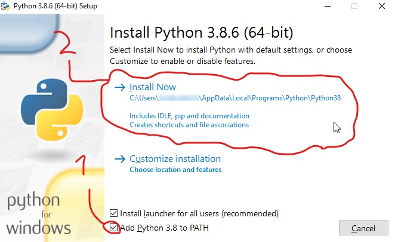

## About Python
_As Written In Python's Site: (I Added The Emojis)_
> Python is powerful... and fast;  
plays well with others; (:two_men_holding_hands: ?)  
runs everywhere; (:running: ?)  
is friendly & easy to learn;  
is Open. (:unlock: ?)  
## download pythoy
sooo... You Need Too Download Python For This Course (If You Can't Download python, You Can Use Codeboard Website. For More Info, Look at IDE's)
The Link Is For Windows 10
ready? here comes...  [the link to download python](https://www.python.org/ftp/python/3.8.6/python-3.8.6-amd64.exe)
Download It As You Download Other Softwears
**BUT** In The Main Window Of The Installer, follow the image:

