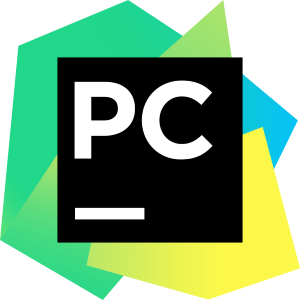
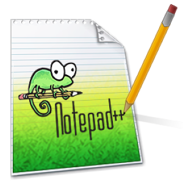
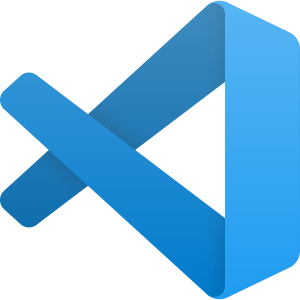
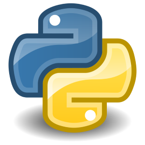

## על פייתון
_כתוב באתר של פייתון: (אני הוספתי את האימוג'ים)_
> Python is powerful... and fast;  
plays well with others; (:two_men_holding_hands: ?)  
runs everywhere; (:running: ?)  
is friendly & easy to learn;  
is Open. (:unlock: ?)  
## הורדת פייתון
בשביל להתחיל צריך את פייתון
הלינק הוא למערכת ההפעלה windows 10
[תלחצו כאן כדי להוריד את פייתון](https://www.python.org/ftp/python/3.8.6/python-3.8.6-amd64.exe)
תורידו את פייתון כמו שאתם מורידים תוכנות אחרות (אם אתם ילדים, תבקשו עזרה מההורים)
**אבל** בחלון הראשי של תוכנת ההתקנה תלחצו כמו שיש בציור:

## IDE - מה זה, והתקנה
שימו לב
גם כאן, כל הלינקים להתקנה הם ל windows 10
 ### PYCHARM  
 

### NOTEPAD++

### ECLIPSE

### VISUAL STUDIO CODE

### IDLE

### CODEBOARD
